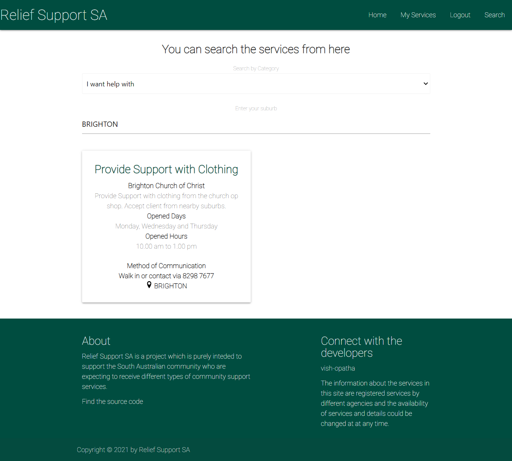

# Relief Support SA

## Overview

This is a project carried out to create to create a community support services portal using **React** to improve the awareness of the services available for the general public.  This is a responsive, mobile-first design. It provides facilities for the general public to search for the services avaialble in their area and the service providing organisations to register the services they provide in the system. This project uses **MERN Stack** and **JWT** token authentication. The project is deployed using **MongoDB and Mongoose(ODB)**.

## Table of Contents

- [Important Links](#Important-Links)
- [Mockup](#Mockup)
- [Usage](#Usage)
- [License](#License)
- [Contribute](#Contributing)
- [Questions](#Questions)


## Important Links

Refer to the following links:

- [Relief Support SA - Deployed page](https://relief-support-sa.herokuapp.com/)

- [Relief Support SA - Github repository](https://github.com/vish-opatha/community-support-portal)

## Mock-up

The following images show the appearance of the webapp.

*Home*

## 


*Search*

## 


*Signup Page*

## 


*Login Page*

## 


*My Services Page*

## 

*Mobile View*

## 

## Usage

You can run the project by cloning this project to your local machine. You need to have MonogoDB Community Server installed in your local computer. To run the project locally, run the following commands one after the other.

```
npm run install -->in the root folder
node server/seeds/seed.js
npm run develop
```

After the above step, the web application will launch itself in the web browser at localhost:3000

---
To use the deployed version, please see the deployed link given in the important links section.

## License

This project is licensed under the MIT license.

## Contributing

Any user can contribute this project by raising an issue in the github repository.

## Questions

If you have any questions about the repo, open an issue or directly contact me at <v.opatha@gmail.com> You can find my other work at [Github](https://github.com/vish-op)

---

Created by Vish Opatha (Last updated on 16 November 2021).
